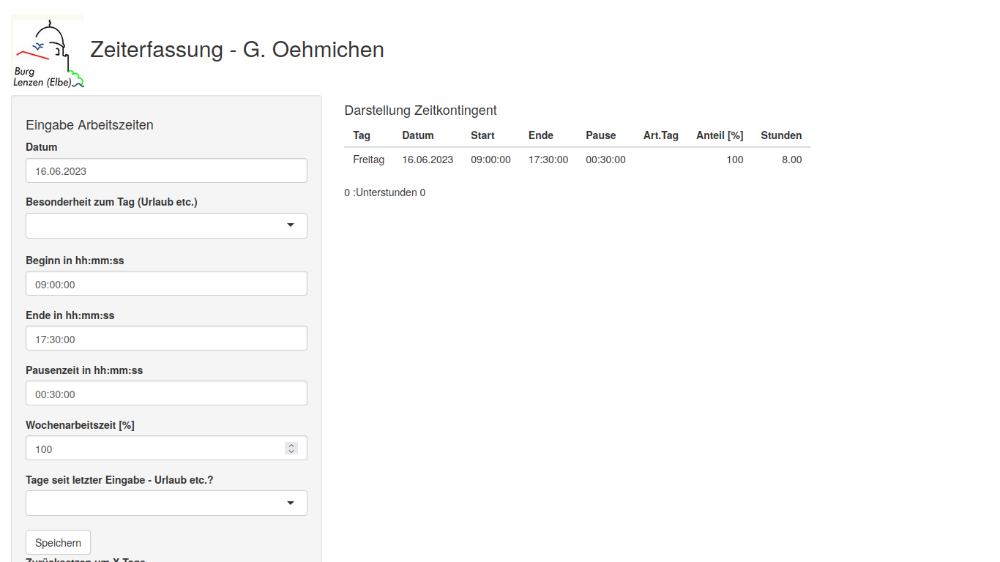
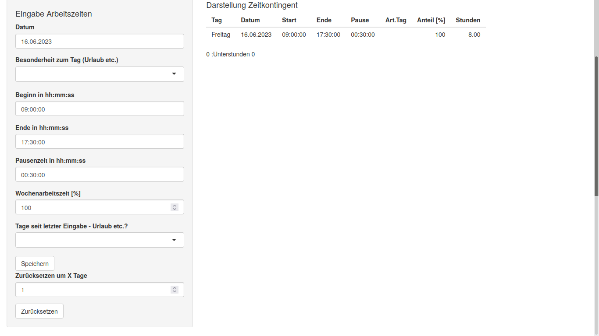

# Zeiterfassung Shiny App

The Zeiterfassung Shiny App is a time tracking application built using R Shiny. It allows you to record and track your work hours, calculate overtime or undertime, and visualize your time data in a table format.

## Features

- Record work hours: Enter your work hours for each day, including the date, start time, end time, and break duration.
- Specify day type: Mark each day as a regular workday, sick day, vacation day, or a national holiday.
- Percentage of full-time: Specify the percentage of full-time work for each day.
- Automatic calculations: The app calculates the total hours worked, overtime or undertime, and displays the data in a table format.
- Data persistence: The entered data is saved locally, allowing you to continue where you left off even after closing the app.
- Data visualization: The app displays the last few days of recorded work hours in a table, including the date, start time, end time, break duration, day type, percentage of full-time, and total hours worked.
- Contingent calculation: The app calculates the overtime or undertime based on the target hours for workdays and displays it as a summary.

## Usage

1. Install the required R packages: `shiny`, `stringr`, `plyr`, `reshape2`, and `chron`.
2. Clone the repository or download the source code files to your local machine.
3. Open the R script `app.R` in RStudio or any other R IDE.
4. Set the working directory to the location where the R script is located.
5. Run the `app.R` script to launch the Shiny app.
6. The app will open in a web browser window, allowing you to interact with it.
7. Enter the work hours, day type, and percentage of full-time for each day using the input fields in the sidebar.
8. Click the "Speichern" (Save) button to record the entered data.
9. The table will display the last few days of recorded work hours, and the contingent (overtime or undertime) will be calculated and displayed below the table.

## Screenshots

## Contributing

Contributions are welcome! If you find any issues or have suggestions for improvements, please feel free to open an issue or submit a pull request.

## License

This project is licensed under the MIT License. See the [LICENSE](LICENSE) file for more details.

